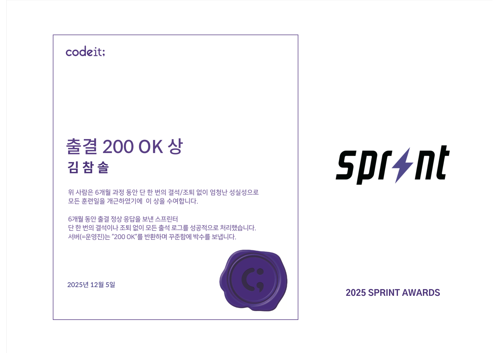
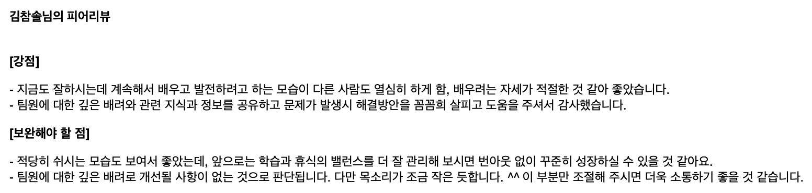
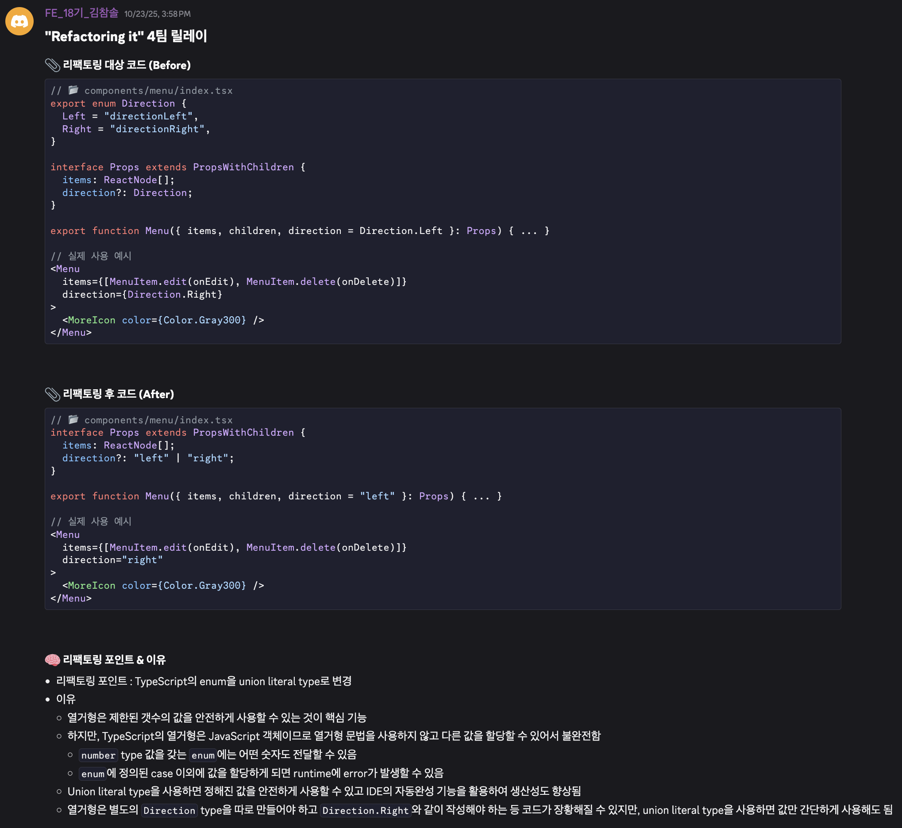

# CodeIt Sprint FE 18

## Overview

- 코드잇 스프린트 부트캠프 Frontend 과정 18기
- 학습 기간 : 2025.06.10 ~ 2025.12.05 (26주)
- 학습 기술
  - HTML, CSS, JavaScript
  - React, Next.js (Page Router)
  - TypeScript
  - styled-components, CSS modules, Tailwind CSS
  - Zustand, React Query
- 성과
  - 출석 100%로 수료
      
  - 가장 많은 스프린트 미션 수행
      

## Projects

- 스프린트 기간 중 3번의 협업 프로젝트 진행
- 모든 프로젝트를 주도적으로 리드하며 다양한 역할 수행
  - 프로젝트 설정 및 배포
  - 팀원 별 실력 차이를 고려한 R&R 분배
  - 개발 공수 산정 및 일정 관리
  - 팀원들이 올리는 PR 검토 및 코드 리뷰
  - 팀원들이 겪는 문제 해결 및 개발 병목 해소

### [Rolling: 롤링 페이퍼 커뮤니티 플랫폼](https://github.com/cskime/rolling)

10주차에 2주간 진행한 기초 프로젝트

- 역할 : 4명 중 팀원으로 참여
- 경험
  - React를 활용한 SPA 개발
  - Styled components를 활용한 styling
  - 공통 컴포넌트 개발; Animation을 고려한 modal 컴포넌트 개발
  - `IntersectionObserver` Web API를 활용한 무한 스크롤 구현
  - Vercel 배포
- 기여
  - 전체 commit의 약 65% push
  - 전체 issue의 약 53% 개발
  - 전체 PR의 약 65% 생성

### [Taskify: 커뮤니티 일정 관리 및 공유 서비스](https://github.com/cskime/Taskify)

17주차에 2주간 진행한 중급 프로젝트

- 역할 : 4명 중 팀장으로 참여
- 경험
  - Next.js를 활용한 web application 개발
  - CSS modules를 활용한 styling
  - 공통 컴포넌트 개발
  - CSR, SSR, ISR 등 page에 적합한 rendering 방식 고민, 개발
  - SSR 환경에서 Web API 사용 시 문제 해결 경험
  - Next.js API routes와 `HttpOnly` cookie를 활용하여 보안을 고려한 access token 인증 로직 구현
- 기여
  - 전체 commit의 약 29% push
  - 전체 issue의 약 24% 개발
  - 전체 PR의 약 23% 생성

### [Coworkers: 업무 배정 및 현황 공유 서비스](https://github.com/cskime/coworkers)

22주차에 4주간 진행한 심화 프로젝트

- 역할 : 4명 중 팀장으로 참여
- 경험
  - Next.js를 활용한 web application 개발
  - Tailwind CSS를 활용한 styling
  - 공통 컴포넌트 개발
  - SSR 환경에서 API routes와 middleware(proxy)를 활용한 유저 인증 로직 구현
  - React Query와 Zustand를 활용한 상태 관리
  - `overlay-kit` package를 활용한 선언적 modal 관리
- 기여
  - 전체 commit의 약 54% push
  - 전체 issue의 약 49% 개발
  - 전체 PR의 약 48% 생성

### 프로젝트 종료 후 동료 평가

프로젝트에 적극적으로 참여하고 원활하게 소통하며 팀원들에게 긍정적인 피드백을 받음

---

---

## 활동

### 학습 외 자체 스터디 진행

코드잇 강의 내용 외에 더 깊이있게 공부하기 위해 동기들과 함께 JavaScript 및 React 스터디 진행

- [코어 자바스크립트 도서 스터디](https://github.com/cskime/study-log/tree/main/core-javascript)
- [React 공식 문서 스터디](https://github.com/FE18-Survivor/react-docs-study)

### 학습 관련 질문/답변

- 스프린트 과정 중 이해되지 않는 개념들을 끝까지 이해하고 넘어가려고 노력함
- 깊이있는 질문 답변 과정을 통해 좋은 답변을 얻기 위한 좋은 질문 하는 방법을 배움
- 질문/답변을 통해 알게 된 내용 정리
  - [styled-components에서 ‘spacing’ prop을 transient prop으로 사용하지 않아도 error가 발생하지 않는 이유](https://cskime.notion.site/styled-components-transient-prop-24140013923d80dca69ac17d71bf8bcd?source=copy_link)
  - [On-Demand ISR 구현 시 revalidate page가 변경된 data로 갱신되지 않는 문제](https://cskime.notion.site/On-Demand-ISR-revalidate-page-data-2bd40013923d8013b6d3f5430c6ccf19?source=copy_link)

### 리팩터링 릴레이

- 중급 프로젝트에서 구현했던 코드 중 개선 사례를 스프린트 동기들과 공유하는 이벤트 참여
- TypeScript에서 `enum`을 사용했을 때 문제점과 union literal type을 활용한 개선 사례 공유
  - 열거형은 제한된 갯수의 값을 안전하게 사용할 수 있는 것이 핵심 기능
  - 하지만, TypeScript의 열거형은 JavaScript 객체로 변환되므로 열거형 문법이 아닌 일반 값도 할당할 수 있어서 불완전함
    - `number` type 값을 갖는 enum에는 어떤 숫자도 전달할 수 있음
    - enum에 정의된 case 이외에 값을 할당하게 되면 runtime에 error가 발생할 수 있음
  - Union literal type을 사용하면 정해진 값을 안전하게 사용할 수 있고 IDE의 자동완성 기능을 활용하여 생산성도 향상됨
  - 열거형은 별도의 Direction type을 따로 만들어야 하고 Direction.Right와 같이 작성해야 하는 등 코드가 장황해질 수 있지만, union literal type을 사용하면 값만 간단하게 사용할 수 있음
- TypeScript 코드가 어떻게 JavaScript 코드로 변환되어 실행되는지 원리를 이해하는 데 도움이 됨